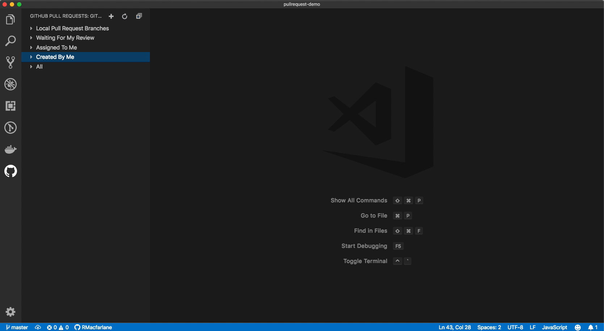
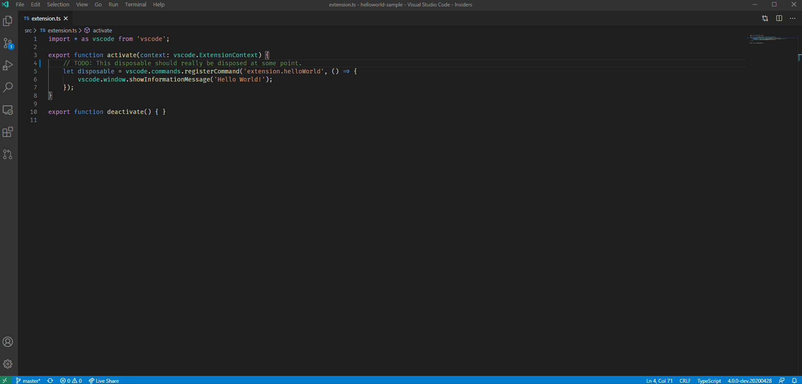

[](https://dev.azure.com/netzerOrg/monday-vscode/_build/latest?definitionId=3&branchName=master)

> Review and manage your Monday Projects, Boards and Items directly in VS Code

This extension allows you to review and manage Monday Projects, Boards and Items directly in VS Code. The support includes:
- Authenticating and connecting VS Code to Monday.
- Listing and browsing Boards, Projects, Items and Users from within VS Code.
- Reviewing Items from within VS Code with in-editor commenting.
- Terminal integration that enables UI and CLIs to co-exist.
- Listing and browsing items from within VS Code.
- Hover cards for "@" mentioned users and for items.
- Completion suggestions for users and items.
- Code actions to create items from "todo" comments.






# Getting Started
It's easy to get started with Monday VSCode Extension. Simply follow these steps to get started.

1. Install the application on your Monday account
[](https://auth.monday.com/oauth2/authorize?client_id=ed8c61ed38205f088d7a499d63a52f56&response_type=install)
1. Download the extension from [the marketplace](https://marketplace.visualstudio.com/items?itemName=Netzer.monday-vscode-extension).
1. Reload VS Code after the installation (click the reload button next to the extension).
1. Authenticate the extension with the application from VS Code.

# Configuring the extension
There are several settings that can be used to configure the extension.

```
"mondayExtension.createIssueTriggers": {
          "type": "array",
          "items": {
            "type": "string",
            "description": "String that enables the 'Create issue from comment' code action. Should not container whitespace."
          },
          "default": [
            "TODO",
            "todo",
            "BUG",
            "FIXME",
            "ISSUE",
            "HACK"
          ],
          "description": "Strings that will cause the 'Create Item from comment' code action to show."
        },
        "mondayExtension.createInsertFormat": {
          "type": "string",
          "enum": [
            "number",
            "url"
          ],
          "default": "number",
          "description": "Controls whether an issue number (ex. #1234) or a full url (ex. https://your-monday-account-name.monday.com/boards/632180646/pulses/633712793) is inserted when the Create Item code action is run."
        },
        "mondayExtension.issueCompletions.enabled": {
          "type": "boolean",
          "default": true,
          "description": "Controls whether completion suggestions are shown for issues."
        },
        "mondayExtension.userCompletions.enabled": {
          "type": "boolean",
          "default": true,
          "description": "Controls whether completion suggestions are shown for users."
        },
```

To view additional settings for the extension, you can open VS Code settings and search for "mondayExtension".

# Issues
This extension is still in development, so please refer to our [issue tracker for known issues](https://github.com/ronnetzer/monday-vs-code-wiki/issues), and please contribute with additional information if you encounter an issue yourself.

## Questions?

See our [wiki](https://github.com/ronnetzer/monday-vs-code-wiki/wiki) for our FAQ.
